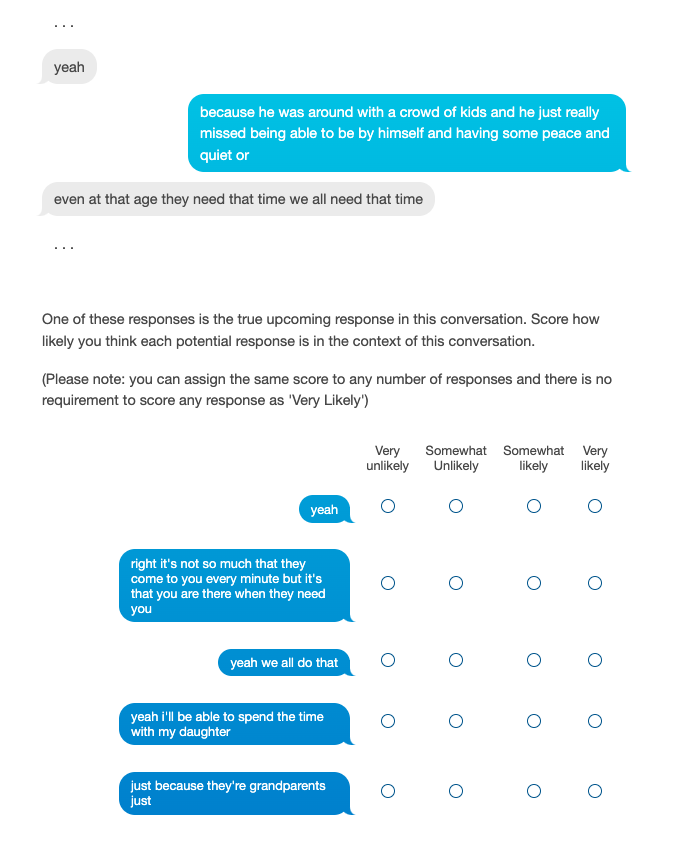
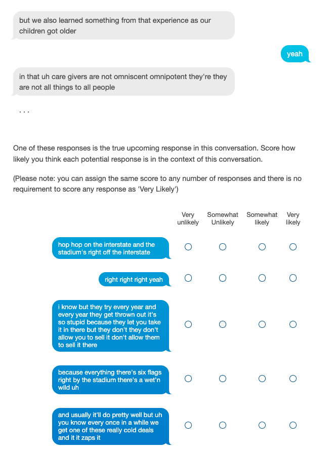

<!-- {}
Click the *Cite* button above to demo the feature to enable visitors to import publication metadata into their reference management software.
{} -->

<!-- {}
Create your slides in Markdown - click the *Slides* button to check out the example.
{} -->
<h2>
Stimuli page for work appearing in <i>Interspeech 2023</i> 
</h2>

  <h3>
  Abstract:
  </h3>
    Speech is a fundamental means of communication that can be seen to provide two channels for transmitting information: the lexical channel of which words are said, and the non-lexical channel of *how* they are spoken. Both channels shape listener expectations of upcoming communication; however, directly quantifying their relative effect on expectations is challenging. Previous attempts require spoken variations of lexically-equivalent dialogue turns or conspicuous acoustic manipulations. This paper introduces a generalised paradigm to study the value of non-lexical information in dialogue across unconstrained lexical content. By quantifying the perceptual value of the non-lexical channel with both accuracy and entropy reduction, we show that non-lexical information produces a consistent effect on expectations of upcoming dialogue: even when it leads to poorer discriminative turn judgements than lexical content alone, it yields higher consensus among participants

<h3>
Stimuli:
</h3>
  <blockquote>
  We provide the full sets of stimuli constructed from the Switchboard corpus along with their associated ratings <a href="https://data.cstr.ed.ac.uk/sarenne/INTERSPEECH2023/">here </a>.
  </blockquote>

  The <a href="https://www.qualtrics.com/">Qualtrics</a> survey (constructed using <a href="https://github.com/CSTR-Edinburgh/qualtreats">`https://github.com/CSTR-Edinburgh/qualtreats`</a>) was presented to participants through <a href="https://www.prolific.co/">Prolific Academic</a>. 
  
  Examples of our presentation in the lexical condition are included below.  Additionally, we provide an example stimulus in the acoustic condition through [this link](https://edinburghinformatics.eu.qualtrics.com/jfe/form/SV_cBg4zwtjHYAlZB4).

  A lexical stimuli:
  
  A lexical check question:
  

